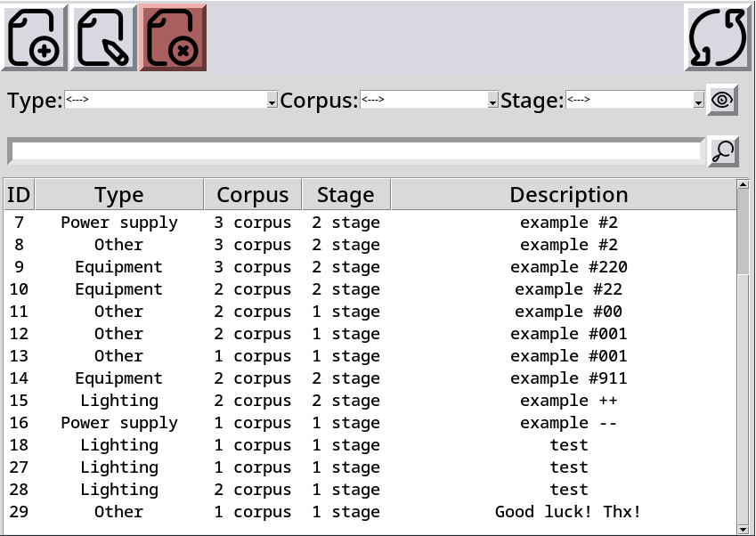

# tk-gui_for_db-table
Example of Tkinter-GUI for database table.
 
Base functions:
- *Creating records*
- *Updating records*
- *Sorting by parameters*
- *Search by names(descriptions)*
- *Record deletion*

